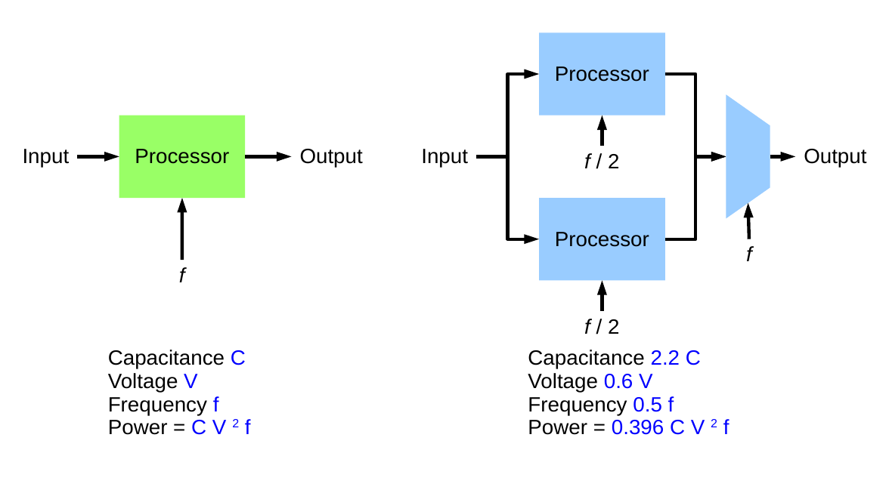
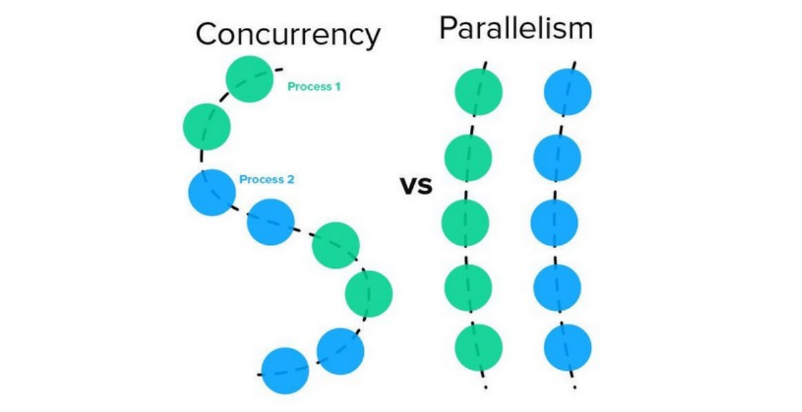
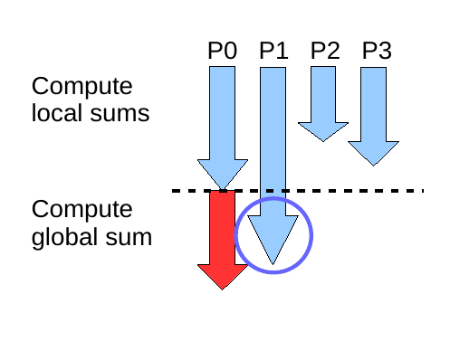
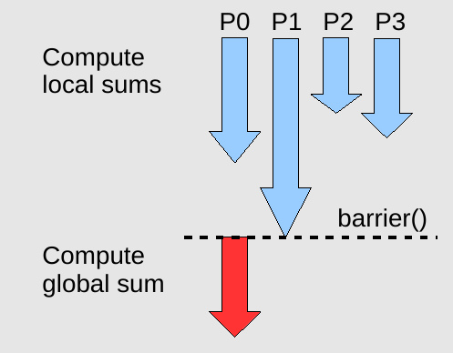
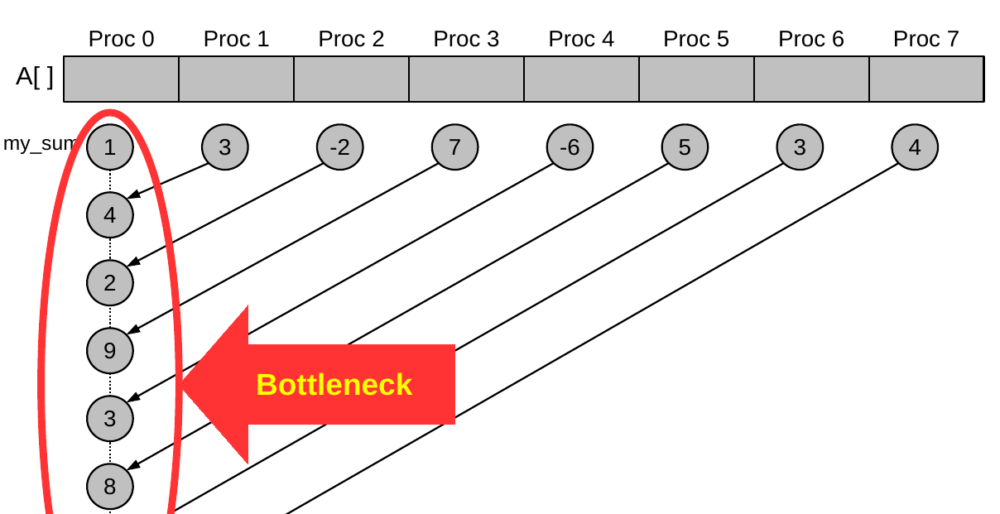
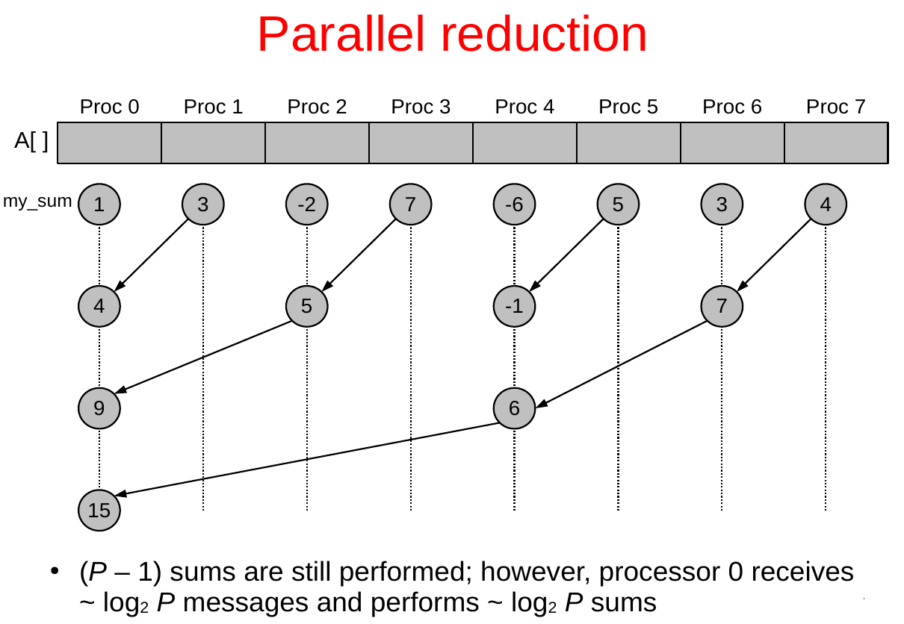

# La parola chiave del corso è: Prestazioni

*Pic from Disney's Cars*

Perché molte applicazioni di grande interesse in vari campi hanno bisogno di una considerevole potenza computazionale: le previsioni del meteo, le simulazioni fisiche, l'animazione 3D, applicazioni per la finanza, etc.

Ci occupiamo quindi di *High Performance Computing* (calcolo ad alte prestazioni) al fine di riuscire a:
- risolvere problemi più complicati (per esempio simulazioni fisiche con tante particelle)
- risolvere lo stesso problema in minor tempo (con la stessa precisione)
- risolvere lo stesso problema con più precisione (nello stesso tempo)
- usare al meglio le risorse del calcolatore 

Ma come possiamo aumentare le prestazioni di una macchina? 
Scopriremo che il nostro **principale nemico**, che abbatte le prestazioni, è la **latenza: la grandezza fisica che descrive il tempo che ci mette il segnale ad arrivare da chi lo emette a chi lo riceve, dipende dalla distanza tra i due e dal mezzo su cui viaggia.***

Parallelizzare il calcolo è un modo per mitigare la latenza.


Nel seguito vedremo una panoramica sul calcolo parallelo per esprimere i seguenti concetti chiave:
- L'utilizzo di architetture parallele viene incentivato naturalmente dalle leggi della fisica.
- L'utilizzo efficiente delle architetture parallele prevede l'utilizzo i paradigmi di programmazione parallela
- Scrivere programmi paralleli è più difficile che scrivere programmi sequenziali.

---
## Aumentare le prestazioni con l'architettura: la fisica ci porta a parallelizzare
> **Legge di Moore:**
> Il numero di transistor in un circuito integrato raddoppia ogni 2 anni (circa) 

Questo significa che ad ogni generazione i processori si basano su transistor sempre più piccoli, che hanno quindi una latenza più bassa, e quindi possono operare a frequenze più elevate.

Tuttavia la fisica ci dice che all'aumentare della frequenza aumenta anche la potenza richiesta dal processore e quindi il calore prodotto per effetto Joule.
> P = V$\cdot$I = C$\cdot$V$^2\cdot$f  
> Dove:
> - V è la tensione del circuito
> - I è la corrente elettrica che scorre nel circuito e si può esprimere come I = C$\cdot$f$\cdot$V
> (Dove C è la capacità elettrica, ovvero la capacita del circuito di immagazzinare energia, e f è la frequenza alla quale opera il circuito  
> *Infatti in un circuito contenente Q cariche, in un giro completo (clock) del circuito, di periodo T e frequenza 1/T, è passata proprio Q carica attraverso una qualsiasi sezione interna fissa (di riferimento) del circuito. Dunque l'intensità di corrente è I = Q/T = Q$\cdot$f. La capacità elettrica è C = Q/V, da cui la formula*

Processori caldi sono inaffidabili e questo pone un limite alla frequenza alla quale spingere un processore.

La formula precedente ci dice però anche che se invece di usare un processore che lavora a frequenza f ne usiamo due in parallelo che lavorano in frequenza f/2, dunque che se opportunamente sfasati permettono comunque di eseguire singole istruzioni a frequenza f (cioè una ogni T), vi è una minore richiesta di potenza e quindi un minore riscaldamento del sistema.

È quindi vantaggioso montare più processori e farli lavorare insieme piuttosto che far lavorare un singolo processore a frequenze eleveate (overclocking)



I costruttori ad oggi infatti producono processori dotati di più core, il che ci porta alla attuale situazione:
- L'hardware parallelo è ovunque
- Il software parallelo è raro
La sfida è quella di rendere il software parallelo tanto comune quanto l'hardware, per estrarre il massimo da hardware che già abbiamo. Tuttavia vedremo che non è così semplice progettare e manutenere software parallelo: sicuramente lo è meno rispetto al software sequenziale. 

---
## Aumentare le prestazioni con la programmazione parallela
Si tratta di:
1. Scomporre il problema in sottoproblemi
2. Distribuire i sottoproblemi sulle unità d'esecuzione disponibili
3. risolvere i sottoproblemi indipendentemente (al massimo cooperando per farlo)

L'obiettivo è quello di:
- Ridurre il wall-clock time (tempo totale di esecuzione)
- Bilanciare il carico di lavoro sulle unità di esecuzione
- Ridurre il sovraccarico di comunicazione e sincronizzazione ??

Nel seguito daremo un'occhiata ai concetti fondamentali nel paradigma parallelo. Si vedrà come l'approccio parallelo richieda molta più attenzione rispetto all'approccio sequenziale.

### Thread vs Processi
Dato uno stesso task (compito) da svolgere posso trattarlo in due modi distinti a seconde che esso condivida o meno la memoria sulla quale lavora con altri compiti che stanno venendo eseguiti:
- I **processi** non possono accedere alle stesse aree di memoria, ovvero l'aria di memoria su cui lavora un processo per svolgere un task è riservata e ci può acceere solamente quello stesso processo
- I **thread** non "privatizzano" la memoria e quindi più thread possono collaborare sullo stesso dato (questo permette di velocizzare l'esecuzione perché è come se dessi più potenza di calcolo, come nell'esempio di architettura con più processori. È utile per esempio nei videoplayer)

Tipicamente i processi sono istanze di esecuzione di software e poi sono eseguiti dividendoli internamente in thread che collaborano potendo condividera la memoria dello specifico processo. Questo permette che programmi diversi possano girare contemporaneamente senza contaminarsi i dati ma comunque con buone prestazioni. 

### Concurrency vs parallelism
- La **concurrency**  è come un cuoco con un solo fornello: porto avanti diversi task dividendone l'esecuzione in timeslices. Eseguo un' istruzione alla volta alternando tra slices di diversi task in modo che ci sia una sorta di multitasking, dando l'impressione che avvengano in contemporanea anche se in realtà avvengono sempre in modo sequenziale. Posso sfruttarla per ottimizzare i casi in cui ho un processo in attesa di qualcosa per privilegiare l'esecuzione di altri processi in quel momento. 
**NB:** Posso avere dei problemi di consistency se condivido i dati, per esempio se condivido il dato del conto bancario ed ho in "contemporanea" un prelievo ed un deposito: entrambi leggono lo stato attuale del conto, uno aggiunge una quantità a quella di partenza, l'altro la toglie da quella di partenza, il primo aggiorna il conto con il nuovo valore e poi lo fa il secondo; in questo modo la prima operazione viene persa. Inoltre questo meccanismo non è prevedibile perché la divisione in timeslice dei task non è deterministica.

Quindi la concurrency **funziona bene solo per i processi**, cioè per task che non operano in contemporanea sugli stessi dati.


- Nel **parallelismo**, che richiede la presenza di più processori (detti "core"), sono in grado di eseguire più istruzioni contemporaneamente. Più processi possono essere eseguiti contemporaneamente (multiprocessing) oppure posso distribuire i thread dello stesso processo sui diversi core (multithreading). Il parallelismo è computazionalmente più potente della concurrency e presenta le stesse problematiche ma esacerbate all'effettiva simultaneità. 

Nelle macchine moderne si usa un approccio misto che si basa sul parallelismo ma che sfrutta la concorrenza (in particolare la divisione in timeslices) in modo da poter eseguire più processi e thread rispetto all'effettivo numero di core della macchina fisica.



### Multiprocessing vs Multithreading
- Nel **multiprocessing** faccio partire più processi che lavorano contemporaneamente, questi non possono condividere tra loro i dati, quindi dovrò fare un sforzo finale per mettere insieme i risultati. È l'approccio che privilegia la consistency a scapito della velocità di esecuzione: sono un po più lento ma sono sicuro che il mio lavoro non viene compromesso dagli altri processi. Inoltre l'impossibilità dell'altro processo di accedere ai dati del primo può essere preferito per motivi di security (per esempio le schede dei browser sono trattate con approccio multiprocessing in modo che non possano scambiare informazioni tra di loro e che quindi schede malevole non possano rubare informazioni sensibili dalle altre schede aperte, come può essere quella della banca) 

- Nel **multithreading** mi fido degli altri thread per lavorare insieme, dunque più rapidamente, sui dati (come scrivere in due in contemporanea sullo google doc). È l'approccio che privilegia la velocità a scapito della consistency. 


### Parallel Computing (HPC) vs Cloud computing (HTC)
L'approccio multithread o multiporcessing può essere compreso meglio guardando ai due casi limite di computazione che ne fanno uso: rispettivamente l'HPC per il multithreading e l'HTC per il multiprocessing.

- Nell'**High performance computing o parallel computing (HPC)** scomponiamo i problemi in sottoproblemi fortemente accoppiati e li eseguiamo su hardware specializzarto e interconnesso finiscamente. Tutti i processori lavorano sugli stessi dati condivisi. Le interconnessioni tra le unità di calcolo (che sono interi calcolatori) sono fondamentali per abbattere la latenza e rappresentano spesso il collo di bottiglia più importante per questo tipo di computazioni. L'importanza delle interconnessioni risulta ancora maggiore per il fatto che i problemi tipici affrontati con questo sistema sono di grandi dimensioni e dunque spesso occorre **distribuire** la memoria su più macchine perché la memoria di una sola non basta a contenere il problema.

- Nell'**high throughtput computing o cloud computing (HTC)** non siamo interessati alla velocità di esecuzione ma a servire tante richieste contemporanee da diversi client. Vogliamo quindi risolvere tanti problemi simili ma con diversi dati e che sono tra loro indipendenti. Possiamo dunque scomporre il problema in poco accoppiati (le richieste dei client) ed eseguirle su commodity hardware, la rete di interconnessione diventa meno importante e la parte più complessa diventa al gestione del corretto smistamento di richieste e risposte

### Task parallelism vs data parallelism
Un ulteriore scelta che si può fare quando si scrive del codice parallelo è quella di decidere se parallelizzare il compito o i dati, ovvero:
- Nel **task parallesim** si assegna ad ogni processore un task (distribuisco i task sui processori). I compiti possono essete differenti e possono operare tutti sugli stessi dati. *Per esempio se ho tre processori uno calcola il massimo, uno il minimo e uno la media dei valori contenuti su ogni riga di una tabella.
- Nel **data parallelism** ogni processore esegue esattamente lo stesso task ma su dati differenti (distribuisco i dati sui processori). *Per esempio se ho tre processori ogni processore calcola massimo, minimo e media dei valori su ogni riga di un terzo di tabella*.

L'approccio più efficiente dipende dal problema, nel caso dell'esempio è più efficiente parallelizzare i dati perché sia per il massimo che per il minimo e la media devo leggere tutta la riga: parallelizzano i dati leggo tre righe in contemporanea e quindi ci metto un terzo del tempo che ci metterei parallelizzando i task, caso risparmio il tempo di due calcoli ma devo leggere per forza tutte le righe

---
## Scrivere codice parallelo è più difficile che scrivere codice sequenziale 
Per quanto detto sopra si capisce che per scrivere codice parallelo efficiente è necessario conoscere e fare uso esplicito dell'hardware parallelo della macchina specifica sulla quale si lavora. Questo implica anche che il codice va aggiornato ogniqualvolta si aggiorna l'hardware sottostante se si vuole mantenere alta la performance: il codice parallelo è tanto meno portabile quanto più è efficiente.

Ancora non esiste un compilatore capace di parallelizzare programmi seriali, se non in casi molto specifici: in generale nessun compilatore è abbastanza intelligente. 
Spesso in realtà non è neanche una buona idea ragionare in maniera seriale e poi cercare di parallelizzare un programma intrinsecamente seriale

### Esempio: la sum reduction (l'hello world della programmazione parallela)
Per vedere alcune delle complicazioni che compaiono quando si scrive codice parallelo guardiamo all'esempio più semplice di parallelizzazion: la sum reduction, ovvero ridurre un vettore ad uno scalare facendo la somma dei suoi elementi.
Partiremo dal caso sequenziale e considereremo architettura a memoria condivisa (tutta contenuta nella stessa macchina e liberamente accessibile da tutti i processori).
> **PROBLEMA**:
> Calcolare la somma degli n elementi di un array A
#### Algoritmo sequenziale
```
float seq_sum(float* A, int n)
{
  int i;
  float sum = 0.0;
  for (i=0; i<n; i++) {
    sum += A[i];
  }
  return sum;
}
```

#### Algoritmo parallelo V1: corretto ma inefficiente
Assumo P unità di esecuzione ognuna delle quali svolge la somma parziale di n/P elementi adiacenti
```
my_block_len = n/P;
my_start = my_id * my_block_len;
my_end = my_start + my_block_len;
sum = 0.0;
for (my_i=my_start; my_i<my_end; my_i++) {
  sum += v[my_i];
}
```
Questo codice è errato poiché c'è una **race conditon** sulla variabile sum a cui potrebbero fare accesso due thread diversi in contemporane, in maniera imprevedibile e causando un comportamento imprevedibile anche esso

Potremmo risolvere usando dei comandi `mutex()` (come dei semafori) per rendere mutualmente esclusivi gli accessi alle variabili condivise, come nel seguente codice:
```
my_block_len = n/P;
my_start = my_id * my_block_len;
my_end = my_start + my_block_len;
sum = 0.0; /* Suppose this is executed exactly once */
mutex m;
for (my_i=my_start; my_i<my_end; my_i++) {
  mutex_lock(&m);
  sum += v[my_i];
  mutex_unlock(&m);
}
```

Tuttavia con questo codice potrei perdere parte dell'array quando vado a partizionarlo se la lunghezza dell'array non è esattamente un multiplo di P, cosa che in generale non possiamo garantire. Quindi dobbiamo modificare la definizione di `my_start` e `my_end` in modo da partizionare tutto l'array nel modo più bilanciato possibile (in modo non avere grandi differenze sulla distribuzione del calcolo anche se le partizioni non hanno tutte lo stesso numero di elementi) 
```
my_start = (n * my_id) / P;
my_end = (n * (my_id + 1)) / P;
```
  
Arriviamo quindi finalmente al codice finale corretto:
```
my_start = (n * my_id) / P;
my_end = (n * (my_id + 1)) / P;
sum = 0.0; /* Suppose this is executed exactly once */
mutex m;
for (my_i=my_start; my_i<my_end; my_i++) {
  mutex_lock(&m);
  sum += v[my_i];
  mutex_unlock(&m);
}
```
Tuttavia questo codice è sostanzialmente sequenziale, ma con più istruzioni e quindi anche più lento del sequenziale stesso.

#### Algoritmo parallelo V2: mutex efficiente
Il precedente algoritmo chiama il `mutex()` per ogni singolo aggiornamento della variabile condivisa `sum` appesantendo il codice. Potremmo far accumulare la somma parziale in ogni processore e poi solo alla fine aggiornare la variabile condivisa, chiamando così il `mutex()` solo una volta per partizione.
```
my_start = (n * my_id) / P;
my_end = (n * (my_id + 1)) / P;
sum = 0.0; my_sum = 0.0; mutex m;
for (my_i=my_start; my_i<my_end; my_i++) {
  my_sum += v[my_i];
}
mutex_lock(&m);
sum += my_sum;
mutex_unlock(&m);
```

#### Algoritmo parallelo V3-4: barrier synchronization
Il `mutex()` si può usare solo nel caso specifico di memoria condivisa, quindi potremmo volerlo rimuovere. In particolare il calcolo parallelo è utile quando il problema è molto grande e tipicamente è difficile che una memoria singola basti.

Una soluzione potrebbe essere quella di usare un array condiviso `psum[]` in cui ogni elemento è una delle somme parziali. Una volta che sono state calcolate tutte le somme parziali allora un solo processore si occuperà di fare la somma degli elementi di `psum[]`:
```
my_start = (n * my_id) / P;
my_end = (n * (my_id + 1)) / P;
psum[0..P-1] = 0.0; /* all elements set to 0.0 */
for (my_i=my_start; my_i<my_end; my_i++) {
  psum[my_id] += v[my_i];
}
if ( 0 == my_id ) { /* only the master executes this */
  sum = 0.0;
  for (my_i=0; my_i<P; my_i++)
    sum += psum[my_i];
}
```
Tuttavia in questo modo il processore che si occupa di fare la somma di `psum[]` potrebbe iniziare a computare la somma globale prima ancora gli altri processori abbiamo finito di calcolare la rispettiva somma parziale, portando ad una sorta di **race condition**. Questo per esempio succede se una delle partizioni è più lunga di quella valutata dal processore che poi farà la somma globale.


Per risolvere il problema possiamo usare l'istruzione `barrier()` per forzare la sincronizzazione prima di calcolare la somma globale: prima di superare l'istruzione `barrier()` tutti i processori devono averla raggiunta
```
my_start = (n * my_id) / P;
my_end = (n * (my_id + 1)) / P;
psum[0..P-1] = 0.0;
for (my_i=my_start; my_i<my_end; my_i++) {
  psum[my_id] += v[my_i];
}
barrier();
local sums
if ( 0 == my_id ) {
  sum = 0.0;
  for (my_i=0; my_i<P; my_i++)
    sum += psum[my_i];
}
```




#### Algoritmo parallelo V5: memoria distribuita
In questo algoritmo supponiamo di avere P << n. La quantità di dati è troppo grande per essere stipata nella memoria di una sola macchina, quindi la distribuiamo su più macchine. Ogni macchina calcola privatamente la somma della porzione di dati nella sua memoria e poi manda il risultato alla macchina 0 (detta master).
```
...
my_sum = 0.0;
my_start = ..., my_end = ...;

for ( i = my_start; i < my_end; i++ ) {
  my_sum += get_value(i);
}
if ( 0 == my_id ) {
  for (i = 1; i < P; i++ ) {
    tmp = receive from proc i;
    my_sum += tmp;
  }
  printf("The sum is %f\n", my_sum);
} else {
  send my_sum to proc 0;
} 
```
Con questo approccio non ho race conditions, infatti ogni cosa in questo approccio gira sulla sua macchina con la sua memoria privata: il multithreading è impossibile, c'è solo il multiprocessing.

Nonostante questo vantaggio il processo è molto macchinoso ed in generale non ho motivo di preferirlo se non realmente necessario, anche perché il trasferimento di dati tra una macchina e l'altra mi crea un bottleneck sul quale non posso fare molto. L'algoritmo è inefficiente perché non prendo subitpo chi finisce per primo ma soprattutto perché il master riceve troppi pacchetti tutti insieme e rallenta il sistema (su commodity hardware si intaserebbe la rete). Nella figura è riportato lo schema visivo del bottleneck e un possibile modo per mitigarlo, detta **parallel reduction**, che sfrutta l'associatività del risultato. 





